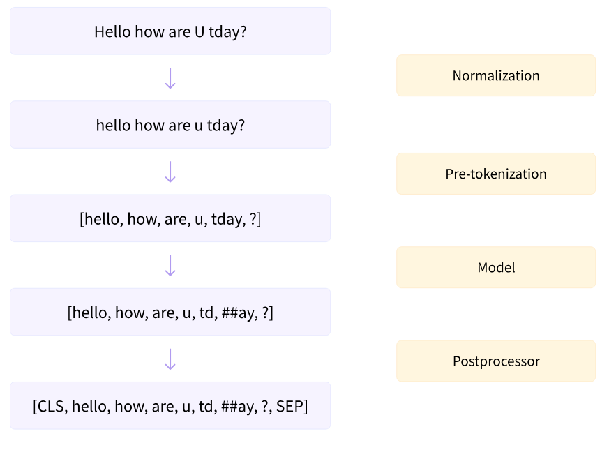
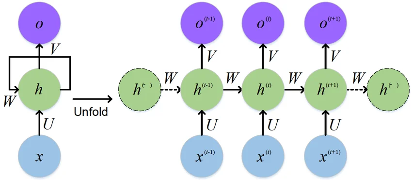
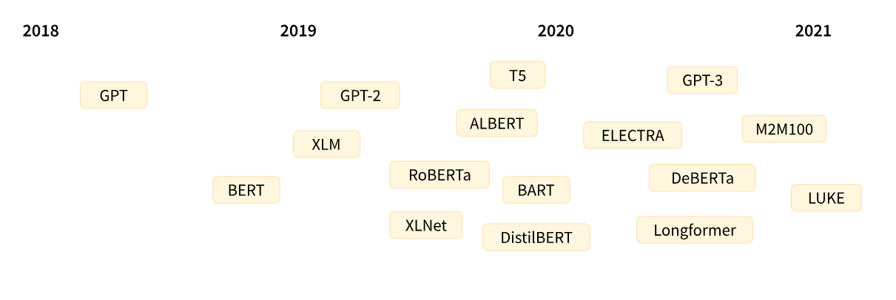

---

Plan : 

- Historique
- Apprentissage supervisé en quelques mots
- Pré-traitement
- Apprentissage de représentations : embeddings
- Multi-layer perceptron (MLP)
- Mécanisme d'(auto-)attention
- (Decoder) Transformer
- Autoregressive generation


---


### Petit historique des avancées en traitement automatique du langage


- 1950 - 2000 : Approches symboliques (ensemble de règles édictées à l'avance)
- 2000 - 2012 : Déput du Deep Learning 
    - Yann Le Cun propose la reconnaissance de chiffres écrits à la main
    - RNN puis LSTM pour obtenir des réseaux prenant en compte les dépendances entre éléments éloignés d'un texte
- 2017 : Les Transformers (!)
- 2018-2024 : L'ère des LLM pré-entraînés
- 2024 - aujourd'hui : IA agentique 

---

## Apprentissage paramétrique

**But :** trouver une fonction paramétrique qui approxime la relation entre les variables d'entrée et de sortie. 
$$
 y = f(\mathbf{x}; \theta)
$$

avec $\mathbf{x} \in \mathbb{R}^d$ une observation et $y \in \mathbb{R}$ la variable cible.

**Exemple :** 

- $\mathbf{x} \in \mathbb{R^{d\times d}}$ est une radiographie 
- $y$ est une variable binaire avec 0 si le patient est *sain*, 0 s'il est *malade*. 


**Procédure :**

- Restriction à **une famille de fonctions paramétriques** 
- on **ajuste** les paramètres $\theta \in \mathbb{R}^p$ pour minimiser une **fonction de perte** mesurant l'erreur entre les prédictions $\hat{y_i} = f(\mathbf{x}_i; \theta)$ et les observations $y_i$.

**Exemples :**

- fonctions linéaires (en ses paramètres), fonctions logistiques, perceptrons Multi-Couche

**Comment fitter les paramètres ?** (aussi appelé **apprentissage**)


--- 

### A chaque problème ses fonctions de perte

- **Régression** : A partir de $\mathbf{x}_i \in \mathbb{R}^d$, estimer une valeur **continue** $y_i \in \mathbb{R}$ (possiblement multi-dimensionnelle mais c'est la même idée). Fonction de perte classique associée : **les moindres carrés** : 
$$
L(\theta) = \sum_{i=1}^n (y_i - \hat{y}_i)^2 = \sum_{i=1}^n (y_i - f(\mathbf{x}_i; \theta))^2
$$

- **Classification** : A partir de $\mathbf{x}_i \in \mathbb{R}^d$, estimer le groupe auquel appartient $i$. Fonction de perte classique associée : **la cross-entropy**. Soit $y_i = (0, ..., 0 , 1, 0,...,0)$ avec un $1$ en k-ième position si $i$ appartient à la classe $k$, alors la cross-entropy s'écrit :

$$
\begin{align*}
L(\theta) & = - \sum_{i=1}^n \log p(y_{i} \mid \mathbf{x}, \theta) \\
& = - \sum_{i=1}^n \sum_{k=1}^K y_{ik} \log (\mathbf{x}_i; \theta) 
\end{align*}
$$

où $\hat{y}_{i,k}$ est la **probabilité prédite** que l'individu $i$ appartienne à la classe $k$.

---

### Apprentissage supervisé : vue d'ensemble

Exemple fil rouge : **prédire le mot suivant**.

<svg viewBox="0 0 1000 520" width="100%" style="max-height:540px" role="img" aria-label="Schéma de l'apprentissage supervisé : phase d'apprentissage et phase de test" font-size="17" text-anchor="middle" dominant-baseline="central">
<defs><marker id="flecheS" viewBox="0 0 10 10" refX="9" refY="5" markerWidth="7" markerHeight="7" orient="auto-start-reverse"><path d="M0,0 L10,5 L0,10 z" fill="#555"/></marker></defs>
<rect x="5" y="5" width="990" height="285" rx="10" fill="#F7F6FD"/>
<rect x="5" y="305" width="990" height="210" rx="10" fill="#FFF8EE"/>
<g font-weight="bold" font-size="19" text-anchor="start" fill="#333">
<text x="22" y="30">Phase d'apprentissage</text><text x="22" y="330">Phase de test</text>
</g>
<g stroke="#555" stroke-width="1.5" fill="none" marker-end="url(#flecheS)">
<line x1="230" y1="115" x2="268" y2="115"/><line x1="480" y1="115" x2="518" y2="115"/><line x1="730" y1="115" x2="768" y2="115"/>
<path d="M875,175 V235 H375 V178"/>
<line x1="320" y1="175" x2="320" y2="353" stroke-dasharray="5 3"/>
<line x1="230" y1="415" x2="268" y2="415"/><line x1="480" y1="415" x2="518" y2="415"/><line x1="730" y1="415" x2="768" y2="415"/>
</g>
<g stroke-width="1.5">
<rect x="20" y="55" width="210" height="120" rx="8" fill="#F3F3F1" stroke="#888780"/>
<rect x="270" y="55" width="210" height="120" rx="8" fill="#EEEDFB" stroke="#7F77DD"/>
<rect x="520" y="55" width="210" height="120" rx="8" fill="#FDF1DF" stroke="#EF9F27"/>
<rect x="770" y="55" width="210" height="120" rx="8" fill="#E3F4EE" stroke="#1D9E75"/>
<rect x="20" y="355" width="210" height="120" rx="8" fill="#F3F3F1" stroke="#888780"/>
<rect x="270" y="355" width="210" height="120" rx="8" fill="#EEEDFB" stroke="#7F77DD"/>
<rect x="520" y="355" width="210" height="120" rx="8" fill="#FDF1DF" stroke="#EF9F27"/>
<rect x="770" y="355" width="210" height="120" rx="8" fill="#fff" stroke="#555"/>
</g>
<g fill="#222">
<text x="125" y="78" font-weight="bold" font-size="15.5">Données d'entraînement</text><text x="125" y="106">(x, y)</text>
<text x="375" y="78" font-weight="bold">Prédiction</text><text x="375" y="106">ŷ = f(x ; θ)</text>
<text x="625" y="78" font-weight="bold">Fonction de perte</text><text x="625" y="106">L(θ)</text>
<text x="875" y="78" font-weight="bold">Rétropropagation</text><text x="875" y="106">θ ← θ − η ∇L(θ)</text>
<text x="125" y="378" font-weight="bold">Données de test</text><text x="125" y="406">(x<tspan dy="5" font-size="13">test</tspan><tspan dy="-5">, y</tspan><tspan dy="5" font-size="13">test</tspan><tspan dy="-5">)</tspan></text>
<text x="375" y="378" font-weight="bold">Modèle figé</text><text x="375" y="406">ŷ = f(x<tspan dy="5" font-size="13">test</tspan><tspan dy="-5"> ; θ̂)</tspan></text>
<text x="625" y="378" font-weight="bold">Évaluation</text><text x="625" y="406">L<tspan dy="5" font-size="13">test</tspan><tspan dy="-5">(θ̂)</tspan></text>
<text x="875" y="378" font-weight="bold">Diagnostic</text>
</g>
<g fill="#555" font-size="14" font-style="italic">
<text x="125" y="136">x = « Le chat noir »</text><text x="125" y="156">y = « dort »</text>
<text x="375" y="136">p(dort | x) = 0.2</text><text x="375" y="156">p(mange | x) = 0.5</text>
<text x="625" y="136">− log p(dort | x)</text><text x="625" y="156">= − log 0.2 ≈ 1.6</text>
<text x="875" y="136">→ p(dort | x) augmente</text><text x="875" y="156">→ L(θ) diminue</text>
<text x="625" y="255">on recommence sur tout le jeu de données, jusqu'à convergence</text>
<text x="330" y="272" text-anchor="start">θ̂ final</text>
<text x="125" y="436">jamais vues pendant</text><text x="125" y="456">l'apprentissage</text>
<text x="375" y="436">« Le soleil » → ?</text><text x="375" y="456">θ̂ n'est plus modifié</text>
<text x="625" y="436">ex : perplexité sur</text><text x="625" y="456">des textes inédits</text>
</g>
<g font-size="14">
<text x="875" y="402" fill="#222">L<tspan dy="4" font-size="11">test</tspan><tspan dy="-4"> ≈ L</tspan><tspan dy="4" font-size="11">train</tspan></text>
<text x="875" y="421" fill="#1D9E75" font-weight="bold">✓ a appris les motifs</text>
<text x="875" y="443" fill="#222">L<tspan dy="4" font-size="11">test</tspan><tspan dy="-4"> ≫ L</tspan><tspan dy="4" font-size="11">train</tspan></text>
<text x="875" y="462" fill="#C0392B" font-weight="bold">✗ a appris par cœur</text>
</g>
</svg>

:::{.notes}
- Le jeu de test ne doit **jamais** servir à choisir les paramètres, sinon l'évaluation est biaisée.
- Sur-apprentissage (*overfitting*) : le modèle mémorise les exemples d'entraînement au lieu d'apprendre les régularités qui permettent de généraliser.
- Pour un LLM, l'étiquette $y$ est simplement le mot suivant dans le texte : pas besoin d'annotation (apprentissage auto-supervisé).
:::

---

# Traitement automatique du langage


---

### Traitement automatique du langage 
(ou Natural Language Processing, NLP)

**Les types de problèmes que l'on souhaite résoudre :**

- **analyse de sentiment** : 
    - "J'adore ce nouveau vélo" -> sentiment positif
    -  dans des formulaires de retour d'expérience "Il y avait trop de blabla dans la présentation" -> sentiment négatif
- **classification de texte** : On donne un texte en entrée, sortie : 1 si créé par l'IA, 0 sinon (ou une probabilité) 
- **traduction automatique** 
- **reconnaissance d'entités nommées** : par exemple en droit, automatisation de la numérisation de documents codifiés mais pas homogènes
- **génération de texte** 


---

##  Tokenization 
(Ou l'art du pré-traitement)


---

### Pré-traitement du texte

{width=80%}

:::{.notes}
construction des briques élémentaires du modèle
:::
--- 

### Tokenization

La **tokenization** est le processus de découpage d'un texte en unités plus petites appelées **tokens**. Ces tokens peuvent être des mots, des sous-mots ou même des caractères, selon la granularité choisie : 

::: {.fragment}
- **charactères** : dur de capturer une semantique mais petit en taille 
"Le chat dort." -> "L", "e", " ", "c", "h", "a", "t", " ", "d", "o", "r", "t", "."
:::

::: {.fragment}
- **mots** : très grand en taille, certaines informations sont redondantes "long", "longeur"
"Le chat dort." -> "Le", "chat", "dort."
:::


:::{.fragment}
- **tokens** : entre les deux, on cherche à décomposer les mots en briques élémentaires
:::


 


:::{.notes}
- mots inconnus (out-of-vocabulary words)
- il y en a beaucoup
- ne capture pas la similarité
- faute d'orthographe
:::


--- 

**Exemple de tokens :**

Texte : "Le chat dort."


Tokens : ["Le", "ch", "at", "do", "rt", "."]

Indices : [100, 21, 255, 183, 87, 47]

embeddings : (juste après)

Le texte a été converti en entiers représentant les indices de chaque token.

L'unité élémentaire est le **token** !


:::{.notes}
On a résolu les limitations des approches précédentes: 

- mots inconnus (out-of-vocabulary words)
- il y en a beaucoup
- ne capture pas la similarité
- faute d'orthographe
:::
---

```{python .code-overflow-wrap}
#| code-fold: true
#| code-summary: "Show the code"

from transformers import AutoTokenizer

tokenizer = AutoTokenizer.from_pretrained("bert-base-cased")
phrase = "Orélien a eu recours à l'IA ?"
print(phrase)
print(f"Tokens associés -> {tokenizer.tokenize(phrase)}")
print(f"input ids -> {tokenizer(phrase)["input_ids"]}")
```


---

### Embeddings et le perceptron multicouche

- Un embedding est une **représentation vectoriel**, d'un token ou tout autre objet (image, graphe, etc...) dans un espace vectoriel (appelé **espace latent**), souvent $\mathbb{R}^d$.

- On différencie les embeddings (représentations continues, aussi appelées denses) des représentations discrètes (sparse / creuses).

- **But :** représenter chaque tokens dans un **espace latent** en encodant **les concepts** et **les sens sémantiques** comme directions dans cet espace.


```{python}
#| echo: false
import plotly.graph_objects as go
import numpy as np
from sklearn.decomposition import PCA

import torch
from transformers import GPT2Model
import tiktoken

enc = tiktoken.get_encoding("gpt2")
model = GPT2Model.from_pretrained("gpt2")
model.eval()
E = model.wte.weight.detach().numpy()

words = [
    "king", "man", "woman",
    "dog", "wolf", "fox",
    "milk", "butter", "cheese",
    "car", "train", "city",
]

# On prend la moyenne des embeddings de chaque mot
X = np.array([E[enc.encode(w)].mean(axis=0) for w in words])  # shape : (len(words), 768)
pca = PCA(n_components=3, random_state=42)
X3 = pca.fit_transform(X)

categories = {
    "kingdom" : ["king", "man", "woman"],
    "animal" : ["dog", "wolf", "fox"],
    "food": ["milk", "butter", "cheese"],
    "location"    : ["car", "train", "city"],
}

colors = {
    "kingdom" : "#7F77DD",
    "animal" : "#1D9E75",
    "food": "#EF9F27",
    "location"    : "#888780",
}

word_to_cat = {w: cat for cat, ws in categories.items() for w in ws}

fig = go.Figure()

for cat, ws in categories.items():
    idx = [words.index(w) for w in ws]
    fig.add_trace(go.Scatter3d(
        x=X3[idx, 0], y=X3[idx, 1], z=X3[idx, 2],
        mode="markers+text",
        name=cat,
        text=ws,
        textposition="top center",
        textfont=dict(size=12),
        marker=dict(size=7, color=colors[cat], opacity=0.9),
    ))

fig.update_layout(
    scene=dict(
        xaxis_title=f"PC1",
        yaxis_title=f"PC2",
        zaxis_title=f"PC3",
    ),
    legend=dict(itemsizing="constant"),
    margin=dict(l=0, r=0, t=30, b=0)
)

fig.show()
```


# Le réseau de neurones récurrent


---

### RNN (Recurrent Neural Networks)

::: {.callout-note title="Idée principale"}
Un RNN traite les données **séquentiellement**, token par token, en maintenant un **état caché** qui encode l'information des tokens précédents.
:::


{width=80%}

**Fonctionnement :**

<button class="collapse-button">▶ Afficher les équations</button>
<div class="collapse-content">
À chaque étape $t$, le RNN met à jour son état caché :

$$
\mathbf{h}_t = \sigma(\mathbf{W}_{hh} \mathbf{h}_{t-1} + \mathbf{W}_{xh} \mathbf{x}_t + \mathbf{b}_h)
$$

- $\mathbf{x}_t$ : embedding du token à la position $t$
- $\mathbf{h}_t$ : état caché (contexte accumulé jusqu'à la position $t$)
- $\mathbf{W}_{hh}, \mathbf{W}_{xh}$ : poids du réseau
- $\sigma$ : fonction d'activation (tanh, ReLU)
</div>


**Le problème central : le gradient qui s'évanouït**

Lors du rétropropagation sur $T$ étapes :
$$
\frac{\partial L}{\partial \mathbf{W}_{hh}} = \sum_{t=1}^{T} \frac{\partial L_t}{\partial \mathbf{h}_T} \cdot \frac{\partial \mathbf{h}_T}{\partial \mathbf{h}_t} \cdots \frac{\partial \mathbf{h}_{t+1}}{\partial \mathbf{h}_t} \cdot \frac{\partial \mathbf{h}_t}{\partial \mathbf{W}_{hh}}
$$

La chaîne de produits $\frac{\partial \mathbf{h}_t}{\partial \mathbf{h}_{t-1}}$ contient des valeurs $< 1$ qui se multiplient, causant une **vanishing gradient** pour les dépendances lointaines.

:::{.notes}
- formule de dérivation de fonctions composées, dérivation en chaîne
:::

---

### LSTM (Long Short-Term Memory)

::: {.callout-note title="Innovation"}
Les LSTM introduisent des **portes** (gates) qui contrôlent le flux d'information, permettant aux gradients de "voyager" plus loin dans le temps.
:::

**Architecture :**

Un LSTM maintient deux états :
- $\mathbf{c}_t$ : **cell state** (mémoire long terme)
- $\mathbf{h}_t$ : **hidden state** (mémoire court terme)

Les mêmes limitations que pour le RNN apparaissent. 

<button class="collapse-button">▶ Afficher les équations</button>
<div class="collapse-content">
Trois portes contrôlent les flux :

$$
\mathbf{f}_t = \sigma(\mathbf{W}_f \cdot [\mathbf{h}_{t-1}, \mathbf{x}_t] + \mathbf{b}_f) \quad \text{(forget gate)}
$$
$$
\mathbf{i}_t = \sigma(\mathbf{W}_i \cdot [\mathbf{h}_{t-1}, \mathbf{x}_t] + \mathbf{b}_i) \quad \text{(input gate)}
$$
$$
\mathbf{C}_t = \tanh(\mathbf{W}_c \cdot [\mathbf{h}_{t-1}, \mathbf{x}_t] + \mathbf{b}_c) \quad \text{(candidate state)}
$$

Mise à jour de la mémoire :
$$
\mathbf{c}_t = \mathbf{f}_t \odot \mathbf{c}_{t-1} + \mathbf{i}_t \odot \mathbf{C}_t
$$

$$
\mathbf{h}_t = \mathbf{o}_t \odot \tanh(\mathbf{c}_t) \quad \text{où } \mathbf{o}_t = \sigma(\mathbf{W}_o \cdot [\mathbf{h}_{t-1}, \mathbf{x}_t] + \mathbf{b}_o)
$$

</div>
---

### Limitations des RNN/LSTM

::: {.callout-important}
1. **Dépendances limitées même avec LSTM** : L'ordre séquentiel limite la capacité à modéliser des dépendances sur très long terme (>100-200 tokens)
:::

::: {.callout-important}
2. **Pas de parallélisation** : Traiter les tokens un à un rend l'entraînement très lent sur GPU/TPU (impossible de traiter les positions en parallèle)
:::

::: {.callout-important}
3. **Goulot d'étranglement informationnel** : L'état caché $\mathbf{h}_t$ doit encoder **toute** l'information pertinente des $t-1$ tokens précédents dans un vecteur de dimension fixe
:::

::: {.callout-important}
4. **Inégalité positionnelle** : Les tokens au début d'une longue séquence ont moins d'influence sur les tokens à la fin (problème du **dilution de l'information**)
:::

**Exemple concret :**

"Alice a parlé avec Bob. Ils ont discuté de nombreux sujets intéressants pendant trois heures. ... Finalement, **elle** a décidé de partir."

Le pronom "elle" dépend d'Alice à 40+ tokens plus tôt, mais les LSTM peinent à maintenir cette relation.

---

### Limitation des méthodes précédentes

**Résumé :**

| Aspect | RNN/LSTM | Problème |
|--------|----------|---------|
| **Dépendances long terme** | ❌ Limitées | Gradients qui s'évanouissent |
| **Parallélisation** | ❌ Séquentiel | Pas d'accélération GPU efficace |
| **Mémoire** | ❌ Goulot | État caché de taille fixe |
| **Scalabilité** | ❌ Lente | Entraînement très long |

**C'est ici qu'interviennent les Transformers ! 🚀**

Ils éliminent la nature séquentielle en utilisant le **mécanisme d'attention**, qui permet :
- ✅ Accès **direct** à tous les tokens (pas de goulot d'étranglement)
- ✅ **Parallélisation complète** de toutes les positions
- ✅ Dépendances **sans limite de distance** (théoriquement)
- ✅ Entraînement **jusqu'à 100x plus rapide**


---

### Mécanisme d'attention

**D'un point de vu haut niveau :** 

- **Input :** une suite d'embeddings $(\mathbf{x}_1, \dots, \mathbf{x}_d)$, un pour chaque tokens 

- **Output :** une nouvelle matrice où chaque embeddings a été mis à jour grâce à l'information contenue dans les autres embeddings de tokens. 


---

### Exemple intuitif : Requête, Clé, Valeur

**Phrase :** "Le chat noir dort tranquillement" (n = 5 tokens)

**Question :** Pour mettre à jour le mot "chat", quels autres mots sont pertinents ?

On va calculer une requête, une clé et une valeur pour chacun des 5 tokens.

::: {.fragment}
**Pour le mot "chat" :**

- **Requête (Q)** : "Je cherche des adjectifs et des verbes"
- **Clés (K)** :
  - "noir" → "Je suis un adjectif" ✓ Match !
  - "dort" → "Je suis un verbe" ✓ Match !
  - "Le" → "Je suis un article" ✗ Pas pertinent
- **Valeurs (V)** :
  - "noir" → "Je suis une couleur"
  - "dort" → "Je suis une action"
  - "Le" → "Je suis un article"
:::

::: {.fragment}
**Résultat final :**

Le mot "chat" combine les informations des autres mots selon leur pertinence :

$$\text{chat}_{new} \approx 0.6 \times V(\text{noir}) + 0.3 \times V(\text{dort}) + 0.1 \times V(\text{Le})$$

Plus la clé (K) correspond à la requête (Q), plus on prend sa valeur (V) ! 🎯
:::


---

### Mécanisme d'attention

::: {.callout-note title=Définition}
**Mécanisme d'attention :** Un mécanisme d'attention est une fonction différentiable $\mathcal{A}: \mathbb{R}^d_q \times \mathbb{R}^{n \times d_k } \times \mathbb{R}^{n \times d_v} \rightarrow \mathbb{R}^{d_v}$ qui prend en entrée une requête, une clé et une valeur, et retourne une combinaison pondérée des valeurs basée sur la *compatibilité* entre les requêtes et les clées.
:::

**Notations :**

- $n$ = nombre de tokens (la longueur de la séquence)
- $\mathbf{Q} = (\mathbf{q}_1, \dots, \mathbf{q}_n) \in \mathbb{R}^{n \times d_k}$ : matrice des requêtes (chaque token pose une question)
- $\mathbf{K} =(\mathbf{k}_1, \dots, \mathbf{k}_n) \in \mathbb{R}^{n \times d_k}$ : matrice des clés (chaque token montre sa signature)
- $\mathbf{V}  = (\mathbf{v}_1, \dots, \mathbf{v}_n) \in \mathbb{R}^{n \times d_v}$ : matrice des valeurs (chaque token apporte son contenu)
- $d_k$ : dimension des clés
- $d_v$ : dimension des valeurs


--- 

### Mécanisme d'attention

Pour une requête $\mathbf{q}$, le mécanisme d'attention calcule alors :

- $e_i = \text{score}(\mathbf{q}, \mathbf{k}_i)$ : score de compatibilité entre la requête $\mathbf{q}$ et la clé $\mathbf{k}_i$

- $\alpha_i = \text{softmax}(e_i)$ : poids d'attention associé à la valeur $\mathbf{v}_i$
- $\mathcal{A}(\mathbf{q}, \mathbf{K}, \mathbf{V}) = \sum_i \alpha_i \mathbf{v}_i$ : représentation de la requête $\mathbf{q}$ étant données les clés $\mathbf{K}$ et les valeurs $\mathbf{V}$.


Il existe plusieurs variantes du mécanisme d'attention, notamment :

- Attention *dot-product* : $\text{score}(\mathbf{q}, \mathbf{k}_i) = \mathbf{q}^\top \mathbf{k}_i$
- Attention *scaled dot-product* : $\text{score}(\mathbf{q}, \mathbf{k}_i) = \frac{\mathbf{q}^\top \mathbf{k}_i}{\sqrt{d_k}}$

<button class="collapse-button">▶ Pourquoi diviser par $\sqrt{d_k}</button>
<div class="collapse-content">
Supposons que les coordonnées de $\mathbf{q}$ et $\mathbf{k}$ soient indépendantes, de moyenne $0$ et de variance $1$. Alors :

$$
\mathbb{E}\left[\mathbf{q}^\top \mathbf{k}\right] = \sum_{j=1}^{d_k} \mathbb{E}[q_j]\,\mathbb{E}[k_j] = 0,
\qquad
\text{Var}\left(\mathbf{q}^\top \mathbf{k}\right) = \sum_{j=1}^{d_k} \text{Var}(q_j k_j) = d_k 
$$

**Conséquence :** avec $d_k = 64$, les scores sont de l'ordre de $\pm 8$, et la softmax devient presque un $\arg\max$ :

$
\text{softmax}(8, 0, -8) \approx (0.9997,\ 0.0003,\ 0.0000)
$
Les dérivées de la softmax sont alors quasi nulles : **le gradient ne passe plus**.
</div>
- Attention multi-têtes (multi-head attention) que l'on verra plus tard.

:::{.notes}
Etapé 1 - Calcul du score : pr chaque position $i$, la scalaire $e_i$ indique la compatibilité, ou pertinence, ou similarité, de la requête $\mathbf{q}$ avec la clé $\mathbf{k}_i$.

Etapé 2 - Application de la softmax : les scores sont normalisés pour obtenir des poids / une distribution de probabilité sur les valeurs.

Etapé 3 - Combinaison des valeurs : les valeurs $\mathbf{v}_i$ sont pondérées par les poids d'attention $\alpha_i$ pour obtenir la représentation finale de la requête.

- Rappel : la dérivée de la softmax est $\frac{\partial \alpha_i}{\partial e_j} = \alpha_i(\delta_{ij} - \alpha_j)$, qui tend vers 0 quand un des $\alpha$ tend vers 1.
:::

---

### Mécanisme d'attention 

Version matricielle pour plusieurs requêtes : 

$$
Attention(\mathbf{Q}, \mathbf{K}, \mathbf{V}) = \text{softmax}\left(\frac{\mathbf{Q}\mathbf{K}^\top}{\sqrt{d_k}}\right)\mathbf{V} \in \mathbb{R^{m \times d_v}}
$$
- 

avec 

- $\mathbf{Q} \in \mathbb{R}^{m \times d_k}$ : matrice des requêtes, m=nombre de requêtes
- $\mathbf{K} \in \mathbb{R}^{n \times d_k}$ : matrice des clés, n=nombre de clés
- $\mathbf{V} \in \mathbb{R}^{n \times d_v}$ : matrice des valeurs, n=nombre de clés/valeurs
- $d_k$ : dimension des clés


---


### Mécanisme d'auto-attention 

::: {.callout-note title=Définition}
Etant donné une matrice d'entrées $\mathbf{X} \in \mathbb{R}^{n \times d_{model}}$ où $n$ est la taille de l'entrée, et $d_{model}$ est la dimension du modèle, le mécanisme d'auto-attention calcule les requêtes, clés et valeurs à partir de $\mathbf{X}$ :

$$
\mathbf{Q} = \mathbf{X}\color{darkred}{\mathbf{W}_Q}, \quad \mathbf{K} = \mathbf{X} \color{darkred}{\mathbf{W}_K}, \quad \mathbf{V} = \mathbf{X}\color{darkred}{\mathbf{W}_V}
$$

où $\color{darkred}{\mathbf{W}_Q} \in \mathbb{R}^{d_{model} \times d_k}, \quad \color{darkred}{\mathbf{W}_K} \in \mathbb{R}^{d_{model} \times d_k}, \quad \color{darkred}{\mathbf{W}_V} \in \mathbb{R}^{d_{model} \times d_v}$ sont des matrices de paramètres à estimer. 

Le mécanisme d'auto-attention (pour le *scaled dot-product*) est donnée par
$$
\text{Attention}_{\theta}(\mathbf{Q}, \mathbf{K}, \mathbf{V}) = \text{softmax}\left(\frac{\mathbf{Q}\mathbf{K}^\top}{\sqrt{d_k}}\right)\mathbf{V}
$$
avec $\theta = \{\mathbf{W}_Q, \mathbf{W}_K, \mathbf{W}_V\}$.
:::

**Interprétation :**

- $\mathbf{q}_i = \mathbf{x_i} \mathbf{W}_Q$ représente l'information recherchée
- $\mathbf{k}_i = \mathbf{x_i} \mathbf{W}_K$ représente l'information disponible pour la comparaison
- $\mathbf{v}_i = \mathbf{x_i} \mathbf{W}_V$ représente le contenu de l'information de la position $i$.


# Du mécanisme d'attention au Transformer


---

### Attention multi-têtes (multi-head attention)

**Problème :** une seule attention = une seule façon de « regarder » la phrase. Or un mot entretient plusieurs types de relations avec les autres :

- "chat" ↔ "noir" : relation **adjectif / nom**
- "chat" ↔ "dort" : relation **sujet / verbe**
- "elle" ↔ "Alice" : relation de **coréférence**

::: {.fragment}
::: {.callout-note title="Définition"}
On calcule $h$ attentions **en parallèle** (les *têtes*), chacune avec ses propres paramètres, puis on concatène les résultats :

$$
\text{head}_i = \text{Attention}(\mathbf{X}\color{darkred}{\mathbf{W}_Q^{(i)}}, \mathbf{X}\color{darkred}{\mathbf{W}_K^{(i)}}, \mathbf{X}\color{darkred}{\mathbf{W}_V^{(i)}}) \in \mathbb{R}^{n \times d_v}
$$

$$
\text{MultiHead}(\mathbf{X}) = \text{Concat}(\text{head}_1, \dots, \text{head}_h)\,\color{darkred}{\mathbf{W}_O} \in \mathbb{R}^{n \times d_{model}}
$$
:::
:::

::: {.fragment}
<button class="collapse-button">▶ Afficher les dimensions</button>
<div class="collapse-content">
- $\mathbf{W}_Q^{(i)}, \mathbf{W}_K^{(i)} \in \mathbb{R}^{d_{model} \times d_k}$, $\quad \mathbf{W}_V^{(i)} \in \mathbb{R}^{d_{model} \times d_v}$, $\quad \mathbf{W}_O \in \mathbb{R}^{h d_v \times d_{model}}$
- En pratique $d_k = d_v = d_{model} / h$ : chaque tête travaille dans un sous-espace plus petit.
- Nombre de paramètres : $3 \times h \times d_{model} \times \frac{d_{model}}{h} + d_{model}^2 = 4\, d_{model}^2$, **indépendant de $h$**.
- Exemple : GPT-2 (small), $d_{model} = 768$, $h = 12$ têtes de dimension $64$.
</div>
:::

:::{.notes}
- Chaque tête peut se spécialiser (syntaxe, coréférence, position...) : cela émerge de l'apprentissage, ce n'est pas imposé.
- $\mathbf{W}_O$ remélange l'information des différentes têtes.
:::

---

### Encodage positionnel : le problème

L'auto-attention est **équivariante par permutation** : si on mélange les tokens, la sortie est mélangée de la même façon.

::: {.callout-note title="Propriété"}
Pour toute matrice de permutation $\mathbf{P} \in \mathbb{R}^{n \times n}$ :
$$
\text{SelfAttention}(\mathbf{P}\mathbf{X}) = \mathbf{P}\ \text{SelfAttention}(\mathbf{X})
$$
:::

<button class="collapse-button">▶ Afficher la preuve</button>
<div class="collapse-content">
Avec $\mathbf{X}' = \mathbf{P}\mathbf{X}$, on a $\mathbf{Q}' = \mathbf{P}\mathbf{Q}$, $\mathbf{K}' = \mathbf{P}\mathbf{K}$, $\mathbf{V}' = \mathbf{P}\mathbf{V}$. Donc
$$
\text{softmax}\left(\frac{\mathbf{P}\mathbf{Q}\mathbf{K}^\top\mathbf{P}^\top}{\sqrt{d_k}}\right)\mathbf{P}\mathbf{V}
= \mathbf{P}\,\text{softmax}\left(\frac{\mathbf{Q}\mathbf{K}^\top}{\sqrt{d_k}}\right)\mathbf{P}^\top\mathbf{P}\mathbf{V}
= \mathbf{P}\,\text{softmax}\left(\frac{\mathbf{Q}\mathbf{K}^\top}{\sqrt{d_k}}\right)\mathbf{V}
$$
car la softmax, appliquée ligne par ligne, commute avec les permutations de lignes et de colonnes, et $\mathbf{P}^\top\mathbf{P} = \mathbf{I}$.
</div>

::: {.fragment}
**Conséquence :** "Le chat mange la souris" et "La souris mange le chat" produisent **les mêmes représentations** pour chaque mot. Le modèle ne connaît pas l'ordre des mots !
:::

::: {.fragment}
::: {.callout-tip title="Solution"}
On **ajoute** à chaque embedding de token un vecteur $\mathbf{p}_t \in \mathbb{R}^{d_{model}}$ qui dépend de sa position $t$ :
$$
\mathbf{x}_t = \mathbf{e}(\text{token}_t) + \mathbf{p}_t
$$
:::
:::

---

### Encodage positionnel : les solutions

**1. Sinusoïdal** (Transformer original, 2017) : $\mathbf{p}_t$ est fixé, pour $i = 0, \dots, d_{model}/2 - 1$ :

$$
p_{t, 2i} = \sin(\omega_i t), \qquad p_{t, 2i+1} = \cos(\omega_i t), \qquad \omega_i = \frac{1}{10000^{2i/d_{model}}}
$$

Chaque paire de coordonnées tourne à une fréquence différente, comme les aiguilles d'une horloge.

::: {.fragment}
**Propriété :** la position $t + k$ s'obtient à partir de $t$ par une **rotation** qui ne dépend que de $k$ :

$$
\begin{pmatrix} \sin(\omega_i (t+k)) \\ \cos(\omega_i (t+k)) \end{pmatrix}
=
\begin{pmatrix} \cos(\omega_i k) & \sin(\omega_i k) \\ -\sin(\omega_i k) & \cos(\omega_i k) \end{pmatrix}
\begin{pmatrix} \sin(\omega_i t) \\ \cos(\omega_i t) \end{pmatrix}
$$

Le modèle peut donc facilement raisonner en **position relative**.
:::

::: {.fragment}
**2. Appris** (GPT, BERT) : $\mathbf{p}_1, \dots, \mathbf{p}_{n_{max}}$ sont des paramètres, estimés comme les embeddings. Limite : pas de séquence plus longue que $n_{max}$.

**3. Rotatif, *RoPE*** (Llama, Mistral...) : on applique la rotation directement à $\mathbf{q}_t$ et $\mathbf{k}_s$, de sorte que le score $\mathbf{q}_t^\top \mathbf{k}_s$ ne dépende que de $t - s$.
:::

---

### Un bloc Transformer

Un bloc = **attention multi-têtes** + **MLP**, chacun suivi d'une **connexion résiduelle** et d'une **normalisation**.

:::: {.columns}
::: {.column width="35%"}
<svg viewBox="0 0 290 530" width="100%" style="max-height:520px" role="img" aria-label="Schéma d'un bloc Transformer" font-size="16" text-anchor="middle" dominant-baseline="central">
<defs><marker id="flecheT" viewBox="0 0 10 10" refX="9" refY="5" markerWidth="7" markerHeight="7" orient="auto-start-reverse"><path d="M0,0 L10,5 L0,10 z" fill="#555"/></marker></defs>
<g stroke="#555" stroke-width="1.5" fill="none" marker-end="url(#flecheT)">
<line x1="130" y1="480" x2="130" y2="442"/><line x1="130" y1="400" x2="130" y2="378"/><line x1="130" y1="342" x2="130" y2="322"/>
<line x1="130" y1="280" x2="130" y2="242"/><line x1="130" y1="200" x2="130" y2="178"/><line x1="130" y1="142" x2="130" y2="122"/><line x1="130" y1="80" x2="130" y2="52"/>
<path d="M130,462 H250 V360 H149" stroke-dasharray="5 3"/><path d="M130,262 H250 V160 H149" stroke-dasharray="5 3"/>
</g>
<g stroke-width="1.5">
<rect x="40" y="480" width="180" height="40" rx="6" fill="#F3F3F1" stroke="#888780"/>
<rect x="40" y="400" width="180" height="40" rx="6" fill="#EEEDFB" stroke="#7F77DD"/>
<circle cx="130" cy="360" r="17" fill="#fff" stroke="#555"/>
<rect x="40" y="280" width="180" height="40" rx="6" fill="#F3F3F1" stroke="#888780"/>
<rect x="40" y="200" width="180" height="40" rx="6" fill="#E3F4EE" stroke="#1D9E75"/>
<circle cx="130" cy="160" r="17" fill="#fff" stroke="#555"/>
<rect x="40" y="80" width="180" height="40" rx="6" fill="#F3F3F1" stroke="#888780"/>
<rect x="40" y="10" width="180" height="40" rx="6" fill="#F3F3F1" stroke="#888780"/>
</g>
<g fill="#222">
<text x="130" y="500">X  (n × d_model)</text><text x="130" y="420">Attention multi-têtes</text><text x="130" y="361" font-size="20">+</text>
<text x="130" y="300">LayerNorm</text><text x="130" y="220">MLP</text><text x="130" y="161" font-size="20">+</text>
<text x="130" y="100">LayerNorm</text><text x="130" y="30">Y  (n × d_model)</text>
</g>
<g fill="#555" font-size="13" font-style="italic">
<text transform="translate(266,411) rotate(-90)">résiduel</text><text transform="translate(266,211) rotate(-90)">résiduel</text>
</g>
</svg>
:::

::: {.column width="65%"}
$$
\begin{aligned}
\mathbf{H} &= \text{LayerNorm}\big(\mathbf{X} + \text{MultiHead}(\mathbf{X})\big) \\
\mathbf{Y} &= \text{LayerNorm}\big(\mathbf{H} + \text{MLP}(\mathbf{H})\big)
\end{aligned}
$$

- **Attention** : les tokens **échangent** de l'information entre eux
- **MLP** : chaque token est transformé **indépendamment**, avec les mêmes poids
- **Entrée et sortie ont la même taille** $n \times d_{model}$ : on peut **empiler** $L$ blocs (12 pour GPT-2 small, 96 pour GPT-3)
:::
::::

<button class="collapse-button">▶ Afficher les équations</button>
<div class="collapse-content">
**MLP** (appliqué à chaque ligne $\mathbf{h} \in \mathbb{R}^{d_{model}}$ de $\mathbf{H}$) :
$$
\text{MLP}(\mathbf{h}) = \sigma(\mathbf{h}\mathbf{W}_1 + \mathbf{b}_1)\,\mathbf{W}_2 + \mathbf{b}_2,
\qquad \mathbf{W}_1 \in \mathbb{R}^{d_{model} \times d_{ff}},\ \mathbf{W}_2 \in \mathbb{R}^{d_{ff} \times d_{model}}
$$
avec en général $d_{ff} = 4\, d_{model}$ et $\sigma$ = ReLU ou GELU.

**LayerNorm** (normalise chaque token sur ses $d_{model}$ coordonnées) :
$$
\text{LayerNorm}(\mathbf{h}) = \boldsymbol{\gamma} \odot \frac{\mathbf{h} - \mu}{\sqrt{\sigma^2 + \varepsilon}} + \boldsymbol{\beta},
\qquad \mu = \frac{1}{d_{model}}\sum_j h_j,\quad \sigma^2 = \frac{1}{d_{model}}\sum_j (h_j - \mu)^2
$$
où $\boldsymbol{\gamma}, \boldsymbol{\beta} \in \mathbb{R}^{d_{model}}$ sont appris.
</div>

:::{.notes}
- Les modèles récents placent la LayerNorm avant l'attention et le MLP (pre-LN) : $\mathbf{H} = \mathbf{X} + \text{MultiHead}(\text{LN}(\mathbf{X}))$, plus stable à l'entraînement.
- On retrouve le MLP vu plus tôt dans la présentation.
:::

---

### Connexions résiduelles : pourquoi ça marche

Chaque sous-couche calcule $\mathbf{y} = \mathbf{x} + F(\mathbf{x})$ au lieu de $\mathbf{y} = F(\mathbf{x})$.

::: {.fragment}
Pour une pile de $L$ blocs $\mathbf{x}_{l+1} = \mathbf{x}_l + F_l(\mathbf{x}_l)$, la dérivation en chaîne donne :

$$
\frac{\partial \mathbf{x}_L}{\partial \mathbf{x}_0} = \prod_{l=0}^{L-1} \left(\mathbf{I} + \frac{\partial F_l}{\partial \mathbf{x}_l}\right) = \mathbf{I} + \sum_{l} \frac{\partial F_l}{\partial \mathbf{x}_l} + \dots
$$
:::

::: {.fragment}
::: {.callout-note}
Le terme $\mathbf{I}$ garantit que le gradient **atteint toujours les premières couches**, même si les $\frac{\partial F_l}{\partial \mathbf{x}_l}$ sont petits.

À comparer avec le RNN : $\frac{\partial \mathbf{h}_T}{\partial \mathbf{h}_t} = \prod \frac{\partial \mathbf{h}_{s+1}}{\partial \mathbf{h}_s}$, un produit de petits termes qui **s'évanouit**.
:::
:::

::: {.fragment}
**Interprétation :** le vecteur $\mathbf{x}_l$ est un « flux résiduel » que chaque bloc **enrichit** par petites touches, plutôt que de le recalculer entièrement.
:::

---

### Combien de paramètres ?

Pour un bloc de dimension $d = d_{model}$ (en négligeant les biais et les LayerNorm) :

| Composant | Matrices | Paramètres |
|-----------|----------|-----------|
| Attention multi-têtes | $\mathbf{W}_Q, \mathbf{W}_K, \mathbf{W}_V, \mathbf{W}_O$ | $4 d^2$ |
| MLP ($d_{ff} = 4d$) | $\mathbf{W}_1, \mathbf{W}_2$ | $8 d^2$ |
| **Total par bloc** | | $\mathbf{12\, d^2}$ |

::: {.fragment}
Pour $L$ blocs et un vocabulaire de taille $|\mathcal{V}|$ :
$$
N \approx 12\, L\, d^2 + |\mathcal{V}|\, d
$$

- **GPT-2 small** : $L = 12$, $d = 768$, $|\mathcal{V}| = 50\,257$ → $85\text{M} + 39\text{M} \approx$ **124 M**
- **GPT-3** : $L = 96$, $d = 12\,288$ → $12 \times 96 \times 12\,288^2 \approx$ **174 Md**
:::

::: {.fragment}
Les **deux tiers** des paramètres sont dans les MLP : on pense qu'ils stockent une grande partie des « connaissances » du modèle.
:::

---

### Complexité : Transformer vs RNN

Pour une séquence de $n$ tokens de dimension $d$ :

| | Coût par couche | Opérations séquentielles | Chemin entre 2 tokens |
|---|:---:|:---:|:---:|
| **RNN** | $O(n\, d^2)$ | $O(n)$ | $O(n)$ |
| **Auto-attention** | $O(n^2 d)$ | $O(1)$ | $O(1)$ |

::: {.fragment}
- **Opérations séquentielles $O(1)$** : toutes les positions sont calculées en même temps → exploitation des GPU
- **Chemin $O(1)$** : deux tokens éloignés sont reliés directement par un poids $\alpha_{ij}$, sans passer par les $j - i$ états intermédiaires
:::

::: {.fragment}
::: {.callout-important title="Le prix à payer"}
La matrice $\mathbf{Q}\mathbf{K}^\top \in \mathbb{R}^{n \times n}$ a un coût **quadratique** en la longueur du texte : doubler le contexte multiplie par 4 le coût de l'attention. C'est pourquoi les modèles ont une **fenêtre de contexte** limitée.
:::
:::

---

### L'architecture Transformer complète

*Attention Is All You Need* (Vaswani et al., 2017), conçu pour la **traduction** :

:::: {.columns}
::: {.column width="50%"}
**Encodeur** (lit la phrase source)

- Tokens → embeddings + positions
- $L$ blocs d'auto-attention **bidirectionnelle** : chaque token voit **toute** la phrase
- Sortie : $\mathbf{Z} \in \mathbb{R}^{n \times d_{model}}$, une représentation contextuelle de chaque token source
:::

::: {.column width="50%"}
**Décodeur** (écrit la traduction)

- Auto-attention **masquée** : un token ne voit que les tokens **précédents**
- **Attention croisée** : les requêtes viennent du décodeur, les clés et valeurs de l'encodeur
- Sortie : probabilité du **prochain token**
:::
::::

::: {.fragment}
::: {.callout-tip title="Trois familles"}
- **Encodeur seul** → BERT (comprendre un texte)
- **Décodeur seul** → GPT (générer du texte)
- **Encodeur + décodeur** → T5, BART (transformer un texte en un autre)
:::
:::

---

### Attention masquée (causale)

Pour **générer** du texte, le modèle ne doit pas « tricher » en regardant les mots qu'il doit prédire.

On ajoute un masque $\mathbf{M} \in \mathbb{R}^{n \times n}$ **avant** la softmax :

$$
\text{Attention}(\mathbf{Q}, \mathbf{K}, \mathbf{V}) = \text{softmax}\left(\frac{\mathbf{Q}\mathbf{K}^\top}{\sqrt{d_k}} + \mathbf{M}\right)\mathbf{V},
\qquad
M_{ij} = \begin{cases} 0 & \text{si } j \leq i \\ -\infty & \text{si } j > i \end{cases}
$$

::: {.fragment}
La matrice d'attention est alors **triangulaire inférieure**.

| | Le | chat | noir | dort |
|---|:---:|:---:|:---:|:---:|
| **Le** | ✓ | ✗ | ✗ | ✗ |
| **chat** | ✓ | ✓ | ✗ | ✗ |
| **noir** | ✓ | ✓ | ✓ | ✗ |
| **dort** | ✓ | ✓ | ✓ | ✓ |
:::

::: {.fragment}
La sortie à la position $i$ ne dépend que de $\mathbf{x}_1, \dots, \mathbf{x}_i$ (et ce, à travers toutes les couches).

**Avantage :** en une seule passe, on **entraîne** le modèle à prédire **les $n$ tokens en parallèle** (séquentiel avec un RNN).
:::

:::{.notes}
- c'est un avantage lors de l'entraînement mais pas lors de la génération de texte ! 
:::

---

{width=80%}

L'évolution des modèles de langage reposant sur les transformers s'accompagne de différence entre les modèles : 

- ceux de type GPT (aussi appelés transformers autorégressifs)
- ceux de type BERT (aussi appelés transformers auto-encodeurs)
- ceux de type BART/T5 (aussi appelés transformers séquence-à-séquence)


# GPT : le Transformer décodeur

---

### GPT (Generative Pre-trained Transformer)

::: {.callout-note title="Architecture"}
Une architecture GPT correspond uniquement à la partie **décodeur** du Transformer avec $L$ blocs à **attention masquée**.
:::

**Modèle de langage :** on veut estimer la probabilité d'un texte $(x_1, \dots, x_T)$. Par la formule des probabilités composées (exacte, sans hypothèse) :

$$
p(x_1, \dots, x_T) = \prod_{t=1}^{T} p(x_t \mid x_1, \dots, x_{t-1})
$$

::: {.fragment}
GPT modélise chaque facteur $p_\theta(x_t \mid x_{<t})$ : **prédire le prochain token** sachant les précédents.

C'est exactement ce que permet le masque causal : la sortie à la position $t-1$ ne voit que $x_1, \dots, x_{t-1}$.
:::

::: {.fragment}
::: {.callout-tip title="Apprentissage auto-supervisé"}
**Pas besoin d'annotations** : n'importe quel texte (Wikipédia, livres, web, code...) fournit ses propres exemples. Chaque texte de $T$ tokens donne $T$ problèmes de prédiction.
:::
:::

---

### Des représentations aux probabilités

Soit $\mathbf{h}_t \in \mathbb{R}^{d_{model}}$ la sortie du dernier bloc à la position $t$.

::: {.fragment}
**1. Projection sur le vocabulaire** (les *logits*) :
$$
\mathbf{z}_t = \mathbf{h}_t \mathbf{W}_U \in \mathbb{R}^{|\mathcal{V}|}, \qquad \mathbf{W}_U \in \mathbb{R}^{d_{model} \times |\mathcal{V}|}
$$
Le logit $z_{t,v} = \mathbf{h}_t^\top \mathbf{e}(v)$ mesure la **similarité** entre $\mathbf{h}_t$ et l'embedding du token $v$.
:::

::: {.fragment}
**2. Softmax :**
$$
p_\theta(x_{t+1} = v \mid x_{\leq t}) = \frac{\exp(z_{t,v})}{\sum_{v' \in \mathcal{V}} \exp(z_{t,v'})}
$$
:::

::: {.fragment}
**3. Fonction de perte** (entropie croisée, ou log-vraisemblance négative) :
$$
\mathcal{L}(\theta) = -\frac{1}{T} \sum_{t=1}^{T} \log p_\theta(x_t \mid x_{<t})
$$

:::

---

### Génération autorégressive

Une fois entraîné, GPT génère du texte **token par token** :

1. On donne un début de texte (le *prompt*) $x_1, \dots, x_t$
2. Le modèle calcule la loi $p_\theta(\cdot \mid x_{\leq t})$ sur tout le vocabulaire
3. On **choisit** un token $x_{t+1}$ selon cette loi
4. On l'ajoute à la séquence et on recommence jusqu'à un token de fin

::: {.fragment}
**Comment choisir ?**

- **Glouton** (*greedy*) : $x_{t+1} = \arg\max_v\, p_\theta(v \mid x_{\leq t})$ → déterministe, souvent répétitif
- **Échantillonnage avec température** $\tau > 0$ :
$$
p_\tau(v) = \frac{\exp(z_v / \tau)}{\sum_{v'} \exp(z_{v'} / \tau)}
\qquad
\begin{cases}
\tau \to 0 & \text{: glouton} \\
\tau = 1 & \text{: loi du modèle} \\
\tau \to \infty & \text{: loi uniforme}
\end{cases}
$$
- **Top-$k$ / top-$p$** : on ne tire que parmi les $k$ tokens les plus probables, ou parmi le plus petit ensemble de tokens de probabilité cumulée $\geq p$
:::

::: {.fragment}
::: {.callout-important}
Le modèle ne « planifie » pas sa réponse : il prédit **un token à la fois**, en se basant uniquement sur ce qui a déjà été écrit.
:::
:::

:::{.notes}
- Pendant l'entraînement, tout est parallèle (masque causal). Pendant la génération, c'est séquentiel : un passage dans le réseau par token généré.
- *KV cache* : les clés et valeurs des tokens déjà traités ne changent pas, on les garde en mémoire pour ne calculer que la nouvelle ligne de l'attention.
:::

---

### De GPT-1 à GPT-3 : le passage à l'échelle

| Modèle | Année | Paramètres | Blocs $L$ | $d_{model}$ | Contexte |
|--------|-------|-----------|-------|-------------|---------|
| GPT-1 | 2018 | 117 M | 12 | 768 | 512 |
| GPT-2 | 2019 | 1,5 Md | 48 | 1 600 | 1 024 |
| GPT-3 | 2020 | 175 Md | 96 | 12 288 | 2 048 |

**Même architecture**, on augmente seulement la taille du modèle et des données.

::: {.fragment}
::: {.callout-note title="Lois d'échelle (Kaplan et al., 2020)"}
La perte de test décroît comme une **loi de puissance** du nombre de paramètres $N$ (données et calcul suffisants) :
$$
\mathcal{L}(N) \approx \left(\frac{N_c}{N}\right)^{\alpha_N}, \qquad \alpha_N \approx 0.076
$$
Même type de loi pour la taille des données et la puissance de calcul : les performances sont **prévisibles**, ce qui a justifié d'investir dans des modèles toujours plus grands.
:::
:::

::: {.fragment}
Avec GPT-3 apparaît l'**apprentissage en contexte** (*in-context learning*) : le modèle résout une nouvelle tâche à partir de quelques exemples donnés dans le prompt, **sans modifier ses paramètres**.
:::


# Des LLM aux agents

---

### Qu'est-ce qu'un agent ?

Un LLM seul est une fonction **texte → texte** :

- ses connaissances sont **figées** à la fin de l'entraînement
- il ne peut **pas agir** : ni chercher sur le web, ni lire un fichier, ni exécuter du code
- il répond **en une fois**, sans vérifier son travail

::: {.fragment}
::: {.callout-note title="Définition"}
Un **agent** est un LLM placé dans une **boucle**, qui peut utiliser des **outils** pour agir sur son environnement et observer le résultat, jusqu'à atteindre un **objectif**.

$$
\text{Agent} = \text{LLM} + \text{outils} + \text{boucle} + \text{mémoire}
$$
:::
:::

::: {.fragment}
**Exemples :**

- **Assistants de code** (Claude Code, Cursor...) : lisent le projet, modifient des fichiers, lancent les tests
- **Recherche approfondie** : enchaînent des dizaines de recherches web puis rédigent une synthèse
- **Assistants personnels** : lisent les mails, consultent l'agenda, réservent un créneau
:::

---

### La boucle agentique

:::: {.columns}
::: {.column width="40%"}
<svg viewBox="0 0 420 400" width="100%" style="max-height:400px" role="img" aria-label="Boucle agentique : raisonner, agir, observer" font-size="16" text-anchor="middle" dominant-baseline="central">
<defs><marker id="flecheA" viewBox="0 0 10 10" refX="9" refY="5" markerWidth="7" markerHeight="7" orient="auto-start-reverse"><path d="M0,0 L10,5 L0,10 z" fill="#555"/></marker></defs>
<g stroke="#555" stroke-width="1.5" fill="none" marker-end="url(#flecheA)">
<line x1="110" y1="56" x2="110" y2="108"/><line x1="210" y1="140" x2="258" y2="140"/><line x1="335" y1="170" x2="335" y2="238"/>
<path d="M260,270 H160 V172"/><line x1="60" y1="170" x2="60" y2="328"/>
</g>
<g stroke-width="1.5">
<rect x="10" y="10" width="200" height="46" rx="6" fill="#F3F3F1" stroke="#888780"/>
<rect x="10" y="110" width="200" height="60" rx="6" fill="#EEEDFB" stroke="#7F77DD"/>
<rect x="260" y="110" width="150" height="60" rx="6" fill="#E3F4EE" stroke="#1D9E75"/>
<rect x="260" y="240" width="150" height="60" rx="6" fill="#FDF1DF" stroke="#EF9F27"/>
<rect x="10" y="330" width="140" height="46" rx="6" fill="#F3F3F1" stroke="#888780"/>
</g>
<g fill="#222">
<text x="110" y="33">Objectif de l'utilisateur</text>
<text x="110" y="130" font-weight="bold">Raisonner</text><text x="110" y="153" font-size="13">(le LLM réfléchit)</text>
<text x="335" y="130" font-weight="bold">Agir</text><text x="335" y="153" font-size="13">(appel d'un outil)</text>
<text x="335" y="260" font-weight="bold">Observer</text><text x="335" y="283" font-size="13">(résultat de l'outil)</text>
<text x="80" y="353">Réponse finale</text>
</g>
<g fill="#555" font-size="13" font-style="italic">
<text x="205" y="288" font-size="12">ajouté au contexte</text><text x="68" y="250" text-anchor="start">si terminé</text>
</g>
</svg>
:::

::: {.column width="60%"}
À chaque tour, le LLM lit **tout l'historique** et décide :

- soit d'**appeler un outil**,
- soit de **répondre** : la boucle s'arrête.

Ce schéma s'appelle **ReAct** (*Reasoning + Acting*, Yao et al., 2022).
:::
::::

::: {.fragment}
**Exemple :** « Faut-il prendre un parapluie demain à Clermont-Ferrand ? »

1. *Raisonner* : « Je dois connaître la météo de demain. »
2. *Agir* : `meteo(ville="Clermont-Ferrand", jour="demain")`
3. *Observer* : `{"pluie": 80%, "temp": 12°C}`
4. *Raisonner* : « 80 % de pluie, c'est élevé. »
5. *Répondre* : « Oui, prenez un parapluie. »
:::

:::{.notes}
- La différence avec un chatbot : le nombre de tours n'est pas fixé à l'avance, c'est le modèle qui décide quand il a fini.
:::

---

### Comment un LLM utilise un outil ?

Le LLM ne fait toujours que **prédire le prochain token**. Tout passe par du texte :

::: {.fragment}
**1. On décrit les outils dans le prompt** : un nom, une description, des paramètres

```json
{"name": "meteo",
 "description": "Donne la météo prévue pour une ville et un jour",
 "parameters": {"ville": "string", "jour": "string"}}
```
:::

::: {.fragment}
**2. Le modèle génère un appel** sous forme de texte structuré (au lieu d'une réponse)

```json
{"tool": "meteo", "arguments": {"ville": "Clermont-Ferrand", "jour": "demain"}}
```
:::

::: {.fragment}
**3. Un programme classique exécute l'appel** et **ajoute le résultat** au contexte, puis on relance le modèle.
:::

::: {.fragment}
::: {.callout-tip}
Formellement, l'agent échantillonne sa prochaine action selon $p_\theta(\text{action} \mid \text{historique})$ : c'est la génération autorégressive, où l'historique contient aussi les résultats des outils. Les modèles sont **fine-tunés** pour savoir quand et comment appeler un outil.
:::
:::

:::{.notes}
- Le protocole MCP (*Model Context Protocol*) standardise la façon de brancher des outils (bases de données, API, fichiers...) sur un agent.
:::

---

### Mémoire et contexte

**Mémoire à court terme = la fenêtre de contexte**

- Tout l'historique (demande, raisonnements, appels d'outils, résultats) est relu à chaque tour
- Elle est **limitée** (coût $O(n^2)$ de l'attention) et se remplit vite : un fichier lu, une page web...
- Solution : **résumer** l'historique quand il devient trop long

::: {.fragment}
**Mémoire à long terme = stockage externe**

- Fichiers de notes, base de données : l'agent y écrit et les relit via des outils
- **Recherche par similarité** (*RAG, Retrieval-Augmented Generation*) : on découpe des documents en morceaux, on calcule leurs **embeddings**, et on ne met dans le contexte que les morceaux les plus proches de la question

$$
\text{score}(\text{question}, \text{doc}) = \cos\big(\mathbf{e}(\text{question}), \mathbf{e}(\text{doc})\big)
$$
:::

::: {.fragment}
On retrouve les **embeddings** du début de la présentation : des textes proches en sens ont des vecteurs proches.
:::

---

### Multi-agents et limites

**Systèmes multi-agents :** un agent **orchestrateur** découpe la tâche et la confie à des **sous-agents** spécialisés, qui travaillent en parallèle et lui renvoient un résumé.

- Chaque sous-agent a **son propre contexte** → on dépasse la limite d'une seule fenêtre
- Ils communiquent en **texte** : consignes de l'orchestrateur, rapports des sous-agents

::: {.fragment}
**Limites :**

- **Coût** : chaque tour relit tout le contexte, des centaines de milliers de tokens pour une tâche
- **Sécurité** : un texte malveillant lu par l'agent (page web, mail) peut contenir des instructions (*injection de prompt*)
:::

::: {.fragment}
::: {.callout-important}
D'où l'importance de **vérifier** (tests, relecture) et de garder un **humain dans la boucle** pour les actions irréversibles.
:::
:::


# Fin de la présentation


# BERT : le Transformer encodeur

---

### BERT (Bidirectional Encoder Representations from Transformers)

::: {.callout-note title="Architecture"}
Uniquement la partie **encodeur** du Transformer : **pas de masque causal** ($\mathbf{M} = 0$), chaque token voit toute la phrase, à gauche **et** à droite.
:::

**Problème :** sans masque, prédire le prochain token est trivial : à la position $t$, le modèle voit déjà $x_{t+1}$ !

::: {.fragment}
**Objectif d'entraînement : le texte à trous** (*Masked Language Modeling*, MLM)

- On tire aléatoirement un ensemble $\mathcal{M}$ de **15 %** des positions
- On remplace ces tokens par `[MASK]` pour obtenir $\tilde{\mathbf{x}}$
- Le modèle doit retrouver les tokens d'origine à partir du contexte **des deux côtés**

"Le [MASK] noir dort tranquillement" → "chat"

$$
\mathcal{L}_{MLM}(\theta) = - \sum_{t \in \mathcal{M}} \log p_\theta(x_t \mid \tilde{\mathbf{x}})
$$
:::

::: {.fragment}
**Différence avec GPT :** $p_\theta(x_t \mid \tilde{\mathbf{x}})$ conditionne sur **toute** la phrase, mais BERT ne définit **pas** de loi jointe $p(x_1, \dots, x_T)$ : on ne peut pas s'en servir pour générer du texte.
:::

:::{.notes}
- Parmi les 15 % : 80 % remplacés par [MASK], 10 % par un token aléatoire, 10 % laissés tels quels (car [MASK] n'apparaît jamais lors de l'utilisation du modèle).
- Seules les positions masquées contribuent à la perte : BERT apprend « moins vite » par texte que GPT.
:::

---

### Représentation de l'entrée

Deux tokens spéciaux :

- `[CLS]` au début : sa représentation finale $\mathbf{h}_{[CLS]}$ sert de **résumé** de tout le texte
- `[SEP]` pour séparer deux phrases A et B

::: {.fragment}
`[CLS]` Le chat dort `[SEP]` Il est fatigué `[SEP]`

L'embedding d'entrée de chaque token est la somme de **trois** vecteurs appris :
$$
\mathbf{x}_t = \underbrace{\mathbf{e}(\text{token}_t)}_{\text{token}} + \underbrace{\mathbf{p}_t}_{\text{position}} + \underbrace{\mathbf{s}_{A \text{ ou } B}}_{\text{segment}}
$$
:::

::: {.fragment}
**Seconde tâche de pré-entraînement** (*Next Sentence Prediction*) : B est-elle la vraie suite de A (50 %) ou une phrase tirée au hasard (50 %) ?
$$
p_\theta(\text{suite} \mid A, B) = \sigma\left(\mathbf{w}^\top \mathbf{h}_{[CLS]}\right)
$$
(Abandonnée par la suite, par exemple dans RoBERTa, car peu utile.)
:::

| Modèle | Paramètres | Blocs $L$ | $d_{model}$ | Têtes $h$ |
|--------|-----------|-------|-------------|-------|
| BERT-base (2018) | 110 M | 12 | 768 | 12 |
| BERT-large (2018) | 340 M | 24 | 1 024 | 16 |

---

### Utiliser BERT : pré-entraînement puis *fine-tuning*

::: {.callout-note title="Deux étapes"}
1. **Pré-entraînement** (très coûteux, fait une fois) : MLM sur des milliards de mots → paramètres $\theta_0$
2. **Fine-tuning** (peu coûteux) : on ajoute une petite couche de sortie et on ré-entraîne **tout** le modèle, en partant de $\theta_0$, sur une tâche précise avec peu de données annotées
:::

::: {.fragment}
**Classification de texte** ($C$ classes, par exemple l'analyse de sentiment) :
$$
p(y \mid \mathbf{x}) = \text{softmax}\left(\mathbf{h}_{[CLS]} \mathbf{W}_c + \mathbf{b}_c\right), \qquad \mathbf{W}_c \in \mathbb{R}^{d_{model} \times C}
$$
:::

::: {.fragment}
**Reconnaissance d'entités nommées** : une prédiction **par token**,
$$
p(y_t \mid \mathbf{x}) = \text{softmax}\left(\mathbf{h}_t \mathbf{W}_c + \mathbf{b}_c\right), \qquad t = 1, \dots, T
$$
:::

::: {.fragment}
Dans les deux cas, on minimise l'entropie croisée $-\sum \log p(y \mid \mathbf{x})$ par rapport à $(\theta, \mathbf{W}_c, \mathbf{b}_c)$.

On retrouve les problèmes de NLP du début de la présentation, résolus par **un seul modèle pré-entraîné** !
:::

:::{.notes}
- Seuls $\mathbf{W}_c, \mathbf{b}_c$ sont nouveaux : $d_{model} \times C$ paramètres, contre 110 M pour BERT-base.
- Le pré-entraînement a déjà appris la syntaxe et une partie de la sémantique : le fine-tuning n'a qu'à les « orienter ».
:::

---

### GPT vs BERT

| | **GPT** | **BERT** |
|---|---|---|
| **Partie du Transformer** | Décodeur | Encodeur |
| **Masque d'attention** | Causal : $\alpha_{ij} = 0$ si $j > i$ | Aucun |
| **Objectif** | $-\sum_t \log p_\theta(x_t \mid x_{<t})$ | $-\sum_{t \in \mathcal{M}} \log p_\theta(x_t \mid \tilde{\mathbf{x}})$ |
| **Loi jointe $p(x_1, \dots, x_T)$** | Oui | Non |
| **Point fort** | **Générer** du texte | **Comprendre / représenter** un texte |
| **Usages** | Chatbots, code, résumé, traduction | Classification, NER, recherche sémantique |
| **Descendants** | GPT-4, Claude, Llama, Mistral... | RoBERTa, CamemBERT, DeBERTa... |

::: {.fragment}
::: {.callout-tip}
Aujourd'hui, les grands modèles génératifs (type GPT) dominent : avec assez de paramètres et de données, **bien prédire** le texte suppose de le **comprendre**. Les modèles type BERT restent très utilisés quand il faut être rapide et peu coûteux (classification, embeddings).
:::
:::


